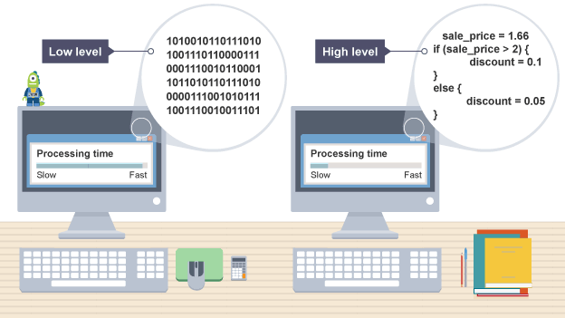
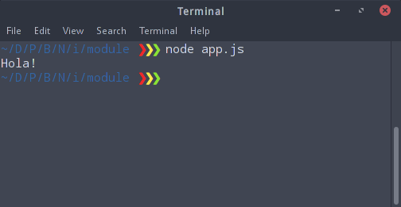
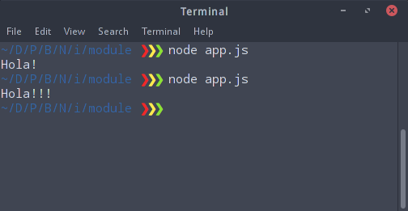
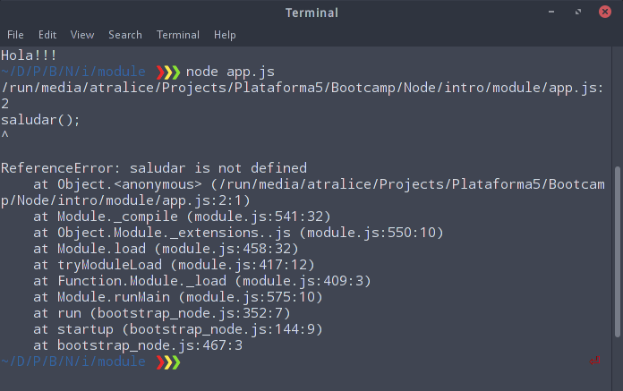
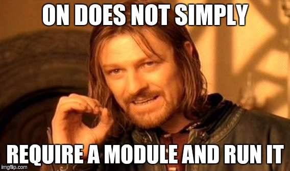
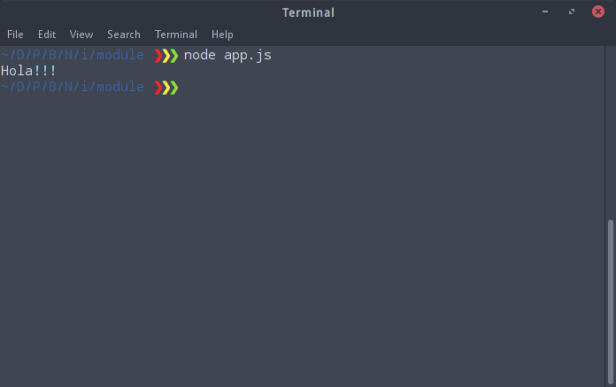

# Introducción a Nodejs


## ¿Qué es Nodejs?

### Conceptos

Para poder entender el concepto de node, primero vamos a tener que conocer otros conceptos más básicos sobre estos temas:

* Procesadores
* Lenguaje de máquina
* C++

Podemos pensar a procesador (microprocesador) como una pequeña máquina que recibe impulsos eléctricos como entrada y genera salidas al que nosotros le pasamos _instrucciones_. Pero el procesador no entiende cualquier lenguaje, sólo habla _lenguaje de máquina_ (es un lenguaje binario, secuencia de unos y ceros) y que está detallado en lo que se conoce como set de instrucciones. Como se imaginarán cada fabricante tiene set de instrucciones distintos y por lo tanto distintos lenguajes, mencionemos algunos:

* IA-32
* x86, x86-64
* ARM
* MIPS

Para pasarle intrucciones al procesador, no escribimos 1's y 0's, sino que usamos un lenguaje que se traduce directamente a esa secuencia, llamado [__assembler__](https://es.wikipedia.org/wiki/Lenguaje_ensamblador). 


Hoy en día no se programa en assembler ([__lenguaje de bajo nivel__](https://es.wikipedia.org/wiki/Lenguaje_de_bajo_nivel)), ya que es muy complejo y hacer un simple 'Hello World' podría llevar muchas líneas de código: Simplemente no escala. Para solucionar esto, se crearon lenguajes más fáciles y rápidos de programar y que compilan a lenguaje de máquina, estos son los conocidos _lenguajes de alto nivel_, JAVA, C++, Javascript son ejemplos de estos lenguajes. Es importante notar, que no importa que lenguaje usemos, en algún momento el código será _traducido_ o _compilado_ a lenguaje de máquina, que es el único lenguaje que entiende verdaderamente la computador.

Como pueden pensar mientras nos alejamos del lenguaje de máquina (lenguajes de más alto nivel) y nos abstraemos vamos ganando velocidad para codear, pero también vamos perdiendo performance. Piensen que si codeamos en lenguaje de máquina, podemos controlar cada slot de memoria nosotros mismos y hacerlo de la mejor forma posible. Cuando subimos de nivel, alguien hace ese trabajo por nosotros, y como tiene que ser genérico no puede lograr ser tan óptimo. Es por eso que según la performance y los recursos que se necesite o tengamos vamos a elegir lenguajes de altisimo o bajísimo nivel. 



_Por ejemplo, los microcontroladores embebidos en lavaropas están programados en C compilado a lenguaje de máquina, esto es porque tienen muy poca memoria y tienen que optimizarla al máximo_

#### C++

[C++](https://es.wikipedia.org/wiki/C%2B%2B) es un lenguaje de programación de bajo nivel, estaría justo por arriba de Assembly. Este lenguaje se hizo muy popular porque es fácil para codear, pero a su vez te deja tener bastante control sobre lo que está pasando en nivel hardware. Muchos otros lenguajes se construyeron en base a C++, o siguiendo sus sintaxis o usándolo en su cadena de abstracción.

Justamente _Nodejs_ está programado en _C++_!
La razón por la que nodejs está escrito en _C++_ es porque __V8__ está escrito en _C++_, ahora veamos qué es V8.

## Motor de Javascript

Antes que nada es importante entender que el lenguaje JavaScript está basado en un standart que se conoce como __ECMASCRIPT__. Este standart setea las bases de qué cosas deberá hacer el lenguaje y cuales no, y de qué manera. Ahora bien, en el mundo real no se respetan los estándares al 100%, es por eso que hay muchas implementaciones distintas de JavaScript, que va a interpretar (convertir el código a lenguaje que pueda ser corrido por la compu) el código de una manera particular, estas implementaciones son los llamados _motores javascript_.

[Ve ocho](https://en.wikipedia.org/wiki/V8_(JavaScript_engine) ) es el motor de javascript creado por __Google__ para su browser _Chrome_. Es un proyecto Open Source asi que podemos investigar su [código](https://chromium.googlesource.com/v8/v8.git), en su página Google define a v8 como:

* V8 JavaScript Engine: _ya sabiamos_.

* V8 is Google's open source JavaScript engine: _really?_.

* V8 implements ECMAScript as specified in ECMA-262: _ah!, sigue estándares, bien!._

* V8 is written in C++ and is used in Google Chrome, the open source browser from Google: _Alguien conoce ese browser Chrome, es bueno?_.

* V8 can run standalone, or can be embedded into any C++ application: _Atención con esto, se puede embeber (usar) en cualquier aplicación C++_

Releamos el último bullet en detalle: Es Standalone, eso quiere decir que puedo bajar V8 y correrlo en mi compu, no necesariamente dentro del browser, genial!; puede ser embebido, es decir que puedo codear una aplicación en _C++_ y agregarle todas las funciones de _V8_, copado!! Ya se imaginan donde empezó a nacer _Nodejs_??

Sí! Nodejs es justamente una aplicación escrita en _C++_ que embebe el motor _V8_ en su código. Por lo tanto puede interpretar código javascript, 'traducirlo' a lenguaje de máquina y finalmente ejecutarlo.
Pero eso no es lo mejor de nodejs, lo mejor es que el creador agregó algunos features que no están definidos en el estándar. Javascript originalmente estaba diseñado para correr en el browser, o sea que nadie pensó en que pudiera leer archivos, o conectarse a una base de datos, etc...
Justamente estas features son las que Nodejs agrega usando código C++. O sea, crea nuevas funciones Javascript que envuelven en realidad funciones de C++, como por ejemplo la función de leer un archivo del filesystem.

Esto hace que NodeJs sea muy poderoso! De hecho, gracias a esto NodeJs tiene todas las features necesarias para poder manejar un servidor.

* Maneras de organizar nuestro código para que sea reusable
* Poder leer y escribir archivos ( input/output)
* Leer y escribir en Bases de Datos
* Poder enviar y recibir datos de internet
* Poder interpretar los formatos estándares
* Alguna forma de manejar procesos que lleven mucho tiempo

## Instalar Nodejs

Para instalar node vamos a ir [acá](https://nodejs.org/en/) y seguir las instrucciones según el sistema operativo ques estés usando.

Una vez terminada la instalación, podemos probar si funciona correctamente escribiendo el siguiente comando en la consola:

```
node -v
```

Si el resultado es algo de la forma: `v6.3.1` entonces habremos instalado Node de manera correcta!

## Core libraries

Nodejs cuenta con un set de librerias ( les vamos a llamar módulos) que vienen por defecto en la instalación. Básicamente es código escrito para hacer tareas muy comunes.
Podemos separar estas librerias en las que están escritas en _C++_ y las que son nativas o están escritas en _javascript_.

### C++

Como dijimos antes, usando el motor _V8_ los desarrolladores de Nodejs agregaron funcionalidad que ECMAscript no tenia en el standar. La mayoría de estas funciones tiene que ver con tareas que también involucran al Sistema operativo, como leer archivos, mandar y recibir datos por la red, comprimir y descomprimir archivosy otras de manejo de streams.

### Javascript

Estas librerías están escritas en Javascript, algunas de ellas implementan la funcionalidad usando javascript, pero la mayoría son sólo envoltorios a las funciones escritas en _C++_ para que puedan ser fácilmente utilizadas por los desarrolladores de Nodejs. Estás son el tipo de librerías que podrías haber escrito vos mismo, por suerte alguien ya se tomó el trabajo!

## Organizando nuestro código en Nodejs

Una de las features que hizo que Nodejs creciera tanto, es justamente el ecosistema de librerias desarrolladas por los usuarios, que sumadas a las librerias _Core_ hacen que sea muy potente.
Ahora vamos a ver cómo poder utilizar módulos en nuestro código, y luego veremos cómo instalar módulos externos.

### Módulos

Def: Un bloque de código reusable, cuya existencia no altera accidentalmente el comportamiento de otros bloques de código.
Este concepto ya existia en otros lenguajes de programación y era muy usado para estructurar proyectos. De todos modos, los módulos no eran parte del standart en ECMAscript (lo agregaron en la última versión), pero Nodejs lo introdujo bajo el nombre de _Commonjs Modules_, que era básicamente un acuerdo (un standart) sobre cómo deberían estar estructurados los módulos.

### Cómo funciona CommonJs Modules?

Básicamente, el standart dice lo siguiente:

- Cada archivo es un ḿodulo, y cada módulo es un archivo separado.
- Todo lo que queremos exportar va a ser expuesto desde un único punto.

Para entender el standart tenemos que tener dos conceptos en claro:

* First-Class Functions: Las funciones en javascript son tratadas igual que cualquier otro objeto, es decir que podés guardarlas en variables, pasarlas como argumentos, guardarlas en arreglos, etcs...
* Function Expressions: Como las funciones son first-class, al escribir una expresión de funcion estoy creando la misma, eso quiere decir que puedo crear funciones en cualquier parte del código. 

Vamos a empezar construyendo nuestro propio módulo! una vez que lo tengamos, vamos a ver como usarlo. Entendiendo así todo el ciclo.

#### Construyendo un módulo

Empezamos con un un archivo `js` vacío. Lo llamaremos `hola.js`, esté será nuestro primer módulo. Lo único que hará este módulo es saludar:

```javascript
console.log('Hola!');
```

Tambien vamos a crear un archivo `js` que se llame `app.js`, en donde vamos a utilizar el código de `hola.js`. Dentro de `app.js` vamos a llamar a la función __require__ que es parte de las core libraries de Nodejs:

```javascript
require('./hola.js');
```

__Require__ recibe como argumento, un string que es el path en donde encontrará el código o el módulo que queremos agregar, en este caso como `hola.js` está en la misma carpeta el path es: `./hola.js`.

Ahora, si corremos el archivo `app.js` usando `node app.js` en la terminal vamos a ver que se ejecutó el código que escribimos en `hola.js`:



Hagamos algo más interesante, vamos a `hola.js` y creemos una función y luego la usemos para saludar:

```javascript
var saludar = function() {
	console.log('Hola!!!');
}
saludar();
```

Corramos de nuevo `app.js`:



El resultado es el mismo!
Ahora, si no invocamos `saludar()` dentro de `hola.ja`, creen que la podremos invocar (usar) en `app.js`? Hagamos la prueba!

Comentamos la invocación en `hola.js`:
```javascript
var saludar = function() {
	console.log('Hola!!!');
}
//saludar();
```
Invacamos en `app.js`:
```javascript
require('./hola.js');
saludar();
```

Veamos el resultado:



saludar no está definido! recibimos un error. De hecho, esto está bien que suceda. Se acuerdan que dijimos que un módulo no debería afectar otro código accidentalmente? Eso quiere decir que el código está protegido y que no podemos simplemente usarlo y acceder a los objetos fuera de ese módulo.



Para usarlo afuera, vamos a tener que explicitarlo, veamos como hacer que podamos usar `saludar()` desde `app.js`.

Nodejs nos permite hacerlo usando `module.exports`, que es una variable especial cuyo objetivo es pasar su contenido a otro pedazo de código cuando llamamos a `require`:

```javascript
var saludar = function() {
	console.log('Hola!!!');
};

module.exports = saludar;
```
Ahora este módulo está exponiendo el objeto `greet`. Para usarlo en nuestro módulo tenemos que guardar lo que devuelve `require` en una variable (puedo llamar a la nueva variable como quiera):

```javascript
var hola = require('./hola.js');

hola();
```

Ahora voy a poder invocar `hola()`, porque lo hemos pasado a través de `module.exports`. Si ejecuto `app.js`:



Ahora pudimos acceder al código de `hola.js`, porque lo expusimos a propósito.

Resumiendo:

- __Require__ es una función que recibe un _path_.
- __module.exports__ es lo que retorna la funcion _require_.

#### Algunos patrones de Require.

Como siempre en Nodejs, hay muchas formas de hacer lo mismo (esto puede ser bueno o malo - según cómo lo usemos) y crear módulos no es la excepción. Veamos algunos patrones comunes en la creacion de módulos!

##### Múltiples imports

La función _require_ busca primero un archivo con el nombre que le pasamos en la carpeta que le pasamos (de hecho no es necesario poner la extensión '.js'). Si no encuentra ese archivo, entonces busca una carpeta con ese nombre y busca un archivo `index.js` el cual importa. Esta funcionalidad la podemos para usar como patrón para importar varios archivos: dentro de `index.js` importamos los demás archivos.

Imaginemos que queremos hacer una función que salude en distintos idiomas, vamos a tener un `app.js` de esta forma:

```javascript
var saludos = require('./saludos');

saludos.english();
saludos.spanish();
```

Estamos importanto solamente el path `./saludos`, como no hay ningún archivo `.js` con ese nombre, _require_ busca una carpeta, por lo tanto vamos a crear una carpeta `saludos` con los siguientes archivos:

index.js
```javascript
var english = require('./english');
var spanish = require('./spanish');

module.exports = {
	english: english,
	spanish: spanish	
};
```

En este archivo estamos importando otros dos módulos, uno por cada idioma en el que queremos saludar. Lo bueno de esto, es que es va a ser muy fácil agregar y sacar idiomas de nuestra aplicación, ya que solo debemos agregar o borrar los idiomas que exportamos!

Ahora veamos como sería cada idioma:

spanish.js
```javascript
var saludos = require('./greetings.json');

var greet = function() {
	console.log(saludos.es);
}

module.exports = greet;
```
english.js
```javascript
var saludos = require('./greetings.json');

var greet = function() {
	console.log(saludos.en);
}

module.exports = greet;
```

y en greetings.json vamos a tener los saludos per se:

```javascript
{
	"en": "Hello",
	"es": "Hola"
}
```

Si ejecutamos nuestra `app.js`:


##### Más Patrones

En la carpeta `./patrones/otro` hemos puesto varios files distintos llamados `saludos` que van del uno al cinco, y luego los importamos en el archivo `app.js`. En cada módulo exportamos lo que necesitamos de manera distinta, cada uno de esas formas constitute un patrón.

Dentro de cada archivo en los comentarios está explicado en más detalle el patrón.

De nuevo, __no hay una mejor forma, prueben todos los patrones y vean cual es el que les gusta y cual los hace felices!__


### Require con modulos Core o nativos

También podemos importar módulos CORE (los que hablamos al principio) usando _require_. Esta función está preparada para que si no encuentra un archivo con el nombre que le pasamos, busca una carpeta, y si no encuentra busca en los módulos nativos.
Podemos ir a la [documentación](https://nodejs.org/dist/latest-v6.x/docs/api/) y ver los módulos que podemos usar.

Veamos como podemos importar algo de esa funcionalidad. Como ejemplo vamos a importar el módulo llamado [`utilities`](https://nodejs.org/dist/latest-v6.x/docs/api/util.html), en la doc vemos que el módulo se llama `util`.
Por lo tanto lo vamos a importar escribiendo

```javascript
var util = require('util'); // No usamos ./ porque es un modulo core 

var nombre = 'Toni';
var saludo = util.format('Hola, %s', nombre);
util.log(saludo);
```

¿Que hace este código? Busquen en la [documentación](https://nodejs.org/dist/latest-v6.x/docs/api/util.html#util_util_format_format) por la función `format()` y `log()` e intenten predecir que hará ese código.