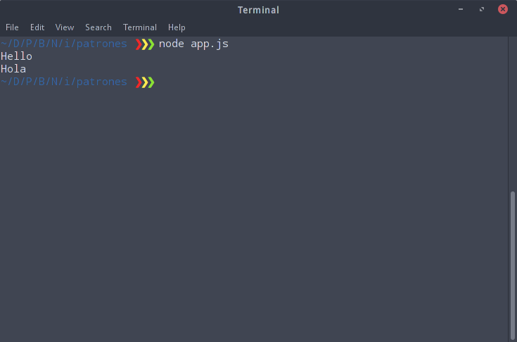

#### Construyendo un módulo

Empezamos con un un archivo `js` vacío. Lo llamaremos `hola.js`, esté será nuestro primer módulo. Lo único que hará este módulo es saludar:

```javascript
console.log('Hola!');
```

Tambien vamos a crear un archivo `js` que se llame `app.js`, en donde vamos a utilizar el código de `hola.js`. Dentro de `app.js` vamos a llamar a la función __require__ que es parte de las core libraries de Nodejs:

```javascript
require('./hola.js');
```

__Require__ recibe como argumento, un string que es el path en donde encontrará el código o el módulo que queremos agregar, en este caso como `hola.js` está en la misma carpeta el path es: `./hola.js`.

Ahora, si corremos el archivo `app.js` usando `node app.js` en la terminal vamos a ver que se ejecutó el código que escribimos en `hola.js`:


Hagamos algo más interesante, vamos a `hola.js` y creemos una función y luego la usemos para saludar:

```javascript
var saludar = function() {
	console.log('Hola!!!');
}
saludar();
```

Corramos de nuevo `app.js`:


El resultado es el mismo!
Ahora, si no invocamos `saludar()` dentro de `hola.js`, creen que la podremos invocar (usar) en `app.js`? Hagamos la prueba!

Comentamos la invocación en `hola.js`:
```javascript
var saludar = function() {
	console.log('Hola!!!');
}
//saludar();
```
Invocamos en `app.js`:
```javascript
require('./hola.js');
saludar();
```

Veamos el resultado:


saludar no está definido! recibimos un error. De hecho, esto está bien que suceda. Se acuerdan que dijimos que un módulo no debería afectar otro código accidentalmente? Eso quiere decir que el código está protegido y que no podemos simplemente usarlo y acceder a los objetos fuera de ese módulo.


Para usarlo afuera, vamos a tener que explicitarlo, veamos como hacer que podamos usar `saludar()` desde `app.js`.

Nodejs nos permite hacerlo usando `module.exports`, que es una variable especial cuyo objetivo es pasar su contenido a otro pedazo de código cuando llamamos a `require`:

```javascript
var saludar = function() {
	console.log('Hola!!!');
};

module.exports = saludar;
```
Ahora este módulo está exponiendo el objeto `saludar`. Para usarlo en nuestro módulo tenemos que guardar lo que devuelve `require` en una variable (puedo llamar a la nueva variable como quiera):

```javascript
var hola = require('./hola.js');

hola();
```

Ahora voy a poder invocar `hola()`, porque lo hemos pasado a través de `module.exports`. Si ejecuto `app.js`:


Ahora pudimos acceder al código de `hola.js`, porque lo expusimos a propósito.

Resumiendo:

- __Require__ es una función que recibe un _path_.
- __module.exports__ es lo que retorna la funcion _require_.

#### Algunos patrones de Require.

Como siempre en Nodejs, hay muchas formas de hacer lo mismo (esto puede ser bueno o malo - según cómo lo usemos) y crear módulos no es la excepción. Veamos algunos patrones comunes en la creacion de módulos!

##### Múltiples imports

La función _require_ busca primero un archivo con el nombre que le pasamos en la carpeta que le pasamos (de hecho no es necesario poner la extensión '.js'). Si no encuentra ese archivo, entonces busca una carpeta con ese nombre y busca un archivo `index.js` el cual importa. Esta funcionalidad la podemos para usar como patrón para importar varios archivos: dentro de `index.js` importamos los demás archivos.

Imaginemos que queremos hacer una función que salude en distintos idiomas, vamos a tener un `app.js` de esta forma:

```javascript
var saludos = require('./saludos');

saludos.english();
saludos.spanish();
```

Estamos importanto solamente el path `./saludos`, como no hay ningún archivo `.js` con ese nombre, _require_ busca una carpeta, por lo tanto vamos a crear una carpeta `saludos` con los siguientes archivos:

index.js
```javascript
var english = require('./english');
var spanish = require('./spanish');

module.exports = {
	english: english,
	spanish: spanish	
};
```

En este archivo estamos importando otros dos módulos, uno por cada idioma en el que queremos saludar. Lo bueno de esto, es que es va a ser muy fácil agregar y sacar idiomas de nuestra aplicación, ya que solo debemos agregar o borrar los idiomas que exportamos!

Ahora veamos como sería cada idioma:

spanish.js
```javascript
var saludos = require('./greetings.json');

var greet = function() {
	console.log(saludos.es);
}

module.exports = greet;
```
english.js
```javascript
var saludos = require('./greetings.json');

var greet = function() {
	console.log(saludos.en);
}

module.exports = greet;
```

y en greetings.json vamos a tener los saludos per se:

```javascript
{
	"en": "Hello",
	"es": "Hola"
}
```

Si ejecutamos nuestra `app.js`:

